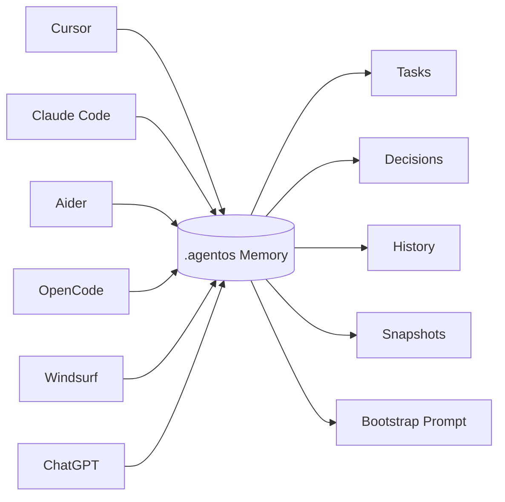
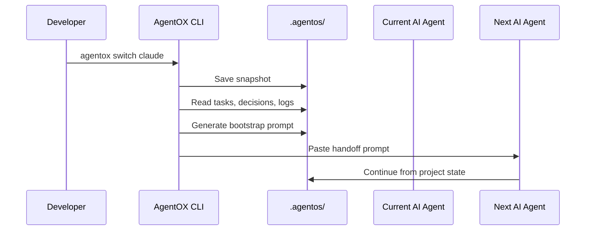
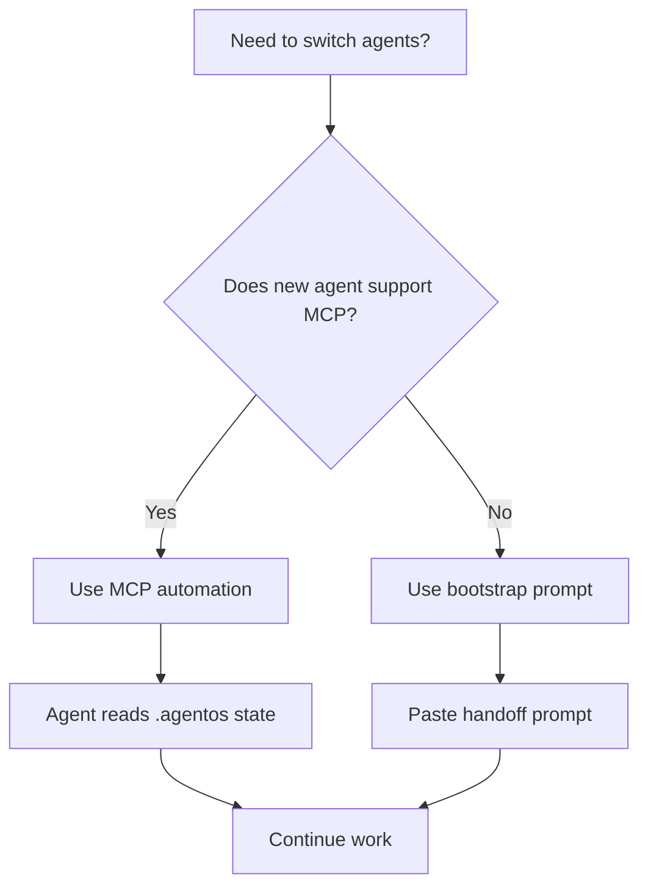

<div align="center">
<picture>
  <source media="(prefers-color-scheme: dark)" srcset="./assets/agentox-hero.svg">
  <source media="(prefers-color-scheme: light)" srcset="./assets/agentox-hero.svg">
  
</picture>
<br />
🤖 AgentOX
Cross-Agent Continuity Layer for AI Coding Assistants
Stop losing context when switching between Cursor, Claude Code, Aider, OpenCode, Windsurf, Antigravity, VS Code, and ChatGPT.
<br />


<br />
<a href="#-quick-start">Quick Start</a>
 • 
<a href="#-how-agentox-works">How It Works</a>
 • 
<a href="#-commands">Commands</a>
 • 
<a href="#-ide-compatibility">IDE Support</a>
 • 
<a href="#-contributing">Contribute</a>
</div>
---
🚀 The Problem
AI coding agents are powerful, but they are bad at continuity.
You start building in Cursor.  
Then you move to Claude Code.  
Then you test something in Aider.  
Then you open the repo in Windsurf.
Every switch creates the same problem:
> The new agent does not know your current tasks, architecture decisions, recent changes, blockers, file structure, or what the previous agent was trying to do.
That means you waste time re-explaining context instead of building.
---
🌟 What is AgentOX?
AgentOX is a file-based continuity layer for AI coding assistants.
It creates a project-local memory system inside your repository:
```txt
.agentos/
├── state.json
├── decisions.json
├── task_graph.json
├── execution_log.jsonl
├── architecture_map.json
└── snapshots/
```
This memory layer stores:
Context Type	What AgentOX Tracks
✅ Tasks	Pending, completed, and active work
✅ Decisions	Architectural rules, hard constraints, stack choices
✅ History	Recent actions, commits, switches, and execution logs
✅ Snapshots	Workspace state before handing off to another agent
✅ Architecture	Project structure, important files, and system map
✅ Bootstrap Prompt	Condensed handoff prompt for the next AI assistant
When you switch agents, AgentOX generates a compact handoff prompt so the next assistant can continue from the same state.
---
✨ Why AgentOX Exists
Most AI coding tools act like isolated brains.
AgentOX gives them a shared memory layer.

---
⚡ Quick Start
1. Install the CLI
```bash
npm install -g agentox
```
2. Initialize AgentOX inside your project
```bash
agentox init
```
This creates the `.agentos/` memory directory.
3. Set your current agent
```bash
agentox use cursor
```
Supported agents:
```bash
claude
cursor
aider
opencode
windsurf
antigravity
chatgpt
```
4. Add tasks
```bash
agentox task add "Build login authentication flow"
agentox task add "Set up PostgreSQL database"
agentox task add "Fix failing test runner"
```
5. Add hard architectural decisions
```bash
agentox decision add "Use React functional components only" --hard
agentox decision add "Do not replace FastAPI with Express" --hard
agentox decision add "Keep database access inside service layer" --hard
```
6. Switch to another agent
```bash
agentox switch claude
```
AgentOX will:
Capture a fresh snapshot
Update execution history
Generate a bootstrap handoff prompt
Copy the prompt to your clipboard
Set the new active agent
---
🧠 How AgentOX Works

---
🧩 What Gets Preserved?
✅ Pending Tasks
```bash
agentox task add "Refactor authentication middleware"
agentox task add "Add GitHub webhook receiver"
agentox task add "Fix Redis worker retry logic"
```
✅ Hard Decisions
```bash
agentox decision add "Never bypass service layer for DB writes" --hard
```
✅ Recent Git Activity
AgentOX can track commits through the post-commit hook created during initialization.
```bash
git commit -m "Add webhook handler"
```
AgentOX records the commit in the execution log.
✅ Bootstrap Handoff Prompt
Example output:
```txt
━━━ AgentOX Continuity Handoff ━━━

Previous agent: cursor
Incoming agent: claude

Current goal:
- Finish GitHub PR review pipeline

Pending tasks:
1. Implement webhook signature validation
2. Add retry logic for failed LLM review calls
3. Store review results in database

Hard decisions:
- Do not replace FastAPI backend
- Keep Celery for async jobs
- Use Redis as queue/cache layer

Recent changes:
- Added /api/v1/analyze endpoint
- Created worker queue structure
- Added repository language detection

Next best action:
Start with webhook signature validation.
```
---
🖥️ IDE Compatibility
IDE / Tool	MCP Automation	Bootstrap Fallback	Best Use Case
Claude Code	✅ Native	✅	Deep implementation, refactors
Cursor	✅ Native	✅	IDE coding, repo navigation
Windsurf	✅ Native	✅	Agentic coding flows
Antigravity	✅ via MCP config	✅	Multi-agent workflows
Aider	⚠️ Manual/CLI	✅	Git-based coding tasks
OpenCode	⚠️ Manual/CLI	✅	Terminal-first coding
VS Code + Copilot	❌ Needs Cline/RooCode	✅	Lightweight fallback
ChatGPT	❌	✅	Planning, review, debugging
Any other AI	❌	✅	Paste bootstrap prompt
> AgentOX works everywhere through Bootstrap fallback.  
> MCP gives zero-paste automation in supported IDEs.
---
🧰 Commands
<details>
<summary><b>Core Commands</b></summary>
Command	Description
`agentox init`	Initialize AgentOX in the current repository
`agentox status`	Show active agent, tasks, decisions, and drift
`agentox use <agent>`	Set active agent without generating handoff
`agentox switch <agent>`	Snapshot state and generate handoff prompt
`agentox repair`	Validate and repair corrupted `.agentos/` files
</details>
<details>
<summary><b>Task Commands</b></summary>
Command	Description
`agentox task add "<task>"`	Add a new pending task
`agentox task list`	Show all tasks
`agentox task done <id>`	Mark task as complete
Example:
```bash
agentox task add "Add OAuth login"
agentox task list
agentox task done 1
```
</details>
<details>
<summary><b>Decision Commands</b></summary>
Command	Description
`agentox decision add "<decision>"`	Add an architectural decision
`agentox decision add "<decision>" --hard`	Add a non-negotiable decision
`agentox decision list`	Show all decisions
Example:
```bash
agentox decision add "Use PostgreSQL for persistent storage" --hard
```
</details>
<details>
<summary><b>Snapshot Commands</b></summary>
Command	Description
`agentox snapshot`	Capture current workspace state
`agentox rollback`	Restore from a previous snapshot
</details>
<details>
<summary><b>Git Integration</b></summary>
Command	Description
`agentox log-commit`	Log git commit into AgentOX history
Usually this is triggered automatically by the Git post-commit hook.
</details>
---
📦 Installation Options
CLI
```bash
npm install -g agentox
```
VS Code / Cursor / Windsurf Extension
Search for:
```txt
AgentOX
```
Install the extension from your IDE marketplace.
Verify Installation
```bash
agentox --version
agentox status
```
---
🧪 Example Workflow
```bash
# Start in Cursor
agentox init
agentox use cursor

# Add current work
agentox task add "Build repo analyzer dashboard"
agentox decision add "Use FastAPI backend and React frontend" --hard

# Work for some time...
git add .
git commit -m "Add dashboard layout"

# Switch to Claude Code
agentox switch claude

# Paste generated handoff prompt into Claude Code
# Claude now understands the current project state
```
---
🛡️ Hard Decisions
Hard decisions are rules that future agents should not casually override.
Example:
```bash
agentox decision add "Do not replace Celery with a custom queue" --hard
```
Use hard decisions for:
Tech stack constraints
Architecture boundaries
Database choices
Security rules
Deployment assumptions
Testing requirements
Bad AI agents randomly rewrite architecture.  
AgentOX makes those decisions explicit.
---
🔄 Bootstrap vs MCP
Mode	How It Works	Best For
Bootstrap	AgentOX generates a prompt you paste manually	Any AI assistant
MCP	IDE/agent reads AgentOX state automatically	Claude Code, Cursor, Windsurf, Antigravity

---
📁 Project Memory Layout
```txt
.agentos/
├── state.json              # Active agent and current state
├── task_graph.json         # Pending/completed task graph
├── decisions.json          # Architectural decisions
├── execution_log.jsonl     # Timeline of agent actions
├── architecture_map.json   # Project structure summary
└── snapshots/              # Workspace snapshots
```
---
🧭 Use Cases
Use Case	Why AgentOX Helps
Switching from Cursor to Claude Code	Claude gets exact project context instantly
Moving from ChatGPT planning to IDE coding	IDE agent receives implementation-ready context
Large refactors	Hard decisions prevent architecture drift
Hackathon projects	Team members can hand off repo state cleanly
Multi-agent workflows	Every agent reads the same continuity layer
Long-running coding sessions	No need to re-explain the project every time
---
🧱 Roadmap
[ ] Rich visual timeline for agent activity
[ ] Better automatic architecture map generation
[ ] More IDE extension support
[ ] Deeper MCP integration
[ ] Team-based shared continuity mode
[ ] Agent performance analytics
[ ] Snapshot diff viewer
[ ] Better rollback preview
---
🤝 Contributing
Contributions are welcome.
Local Setup
```bash
git clone https://github.com/YOUR_USERNAME/agentox.git
cd agentox
npm install
```
Create a Branch
```bash
git checkout -b feature/my-feature
```
Commit and Push
```bash
git add .
git commit -m "Add my feature"
git push origin feature/my-feature
```
Then open a pull request.
Good contribution areas:
More AI agent integrations
Better handoff prompt templates
Extension improvements
Snapshot reliability
MCP automation
Documentation examples
---
📄 License
AgentOX is licensed under the MIT License.
See LICENSE for details.
---
<div align="center">
Built for developers who switch tools but do not want to lose momentum.
<br />
Install AgentOX
```bash
npm install -g agentox
```
<br />
<a href="#-quick-start">Get Started</a>
 • 
<a href="#-commands">Commands</a>
 • 
<a href="#-contributing">Contribute</a>
</div>
