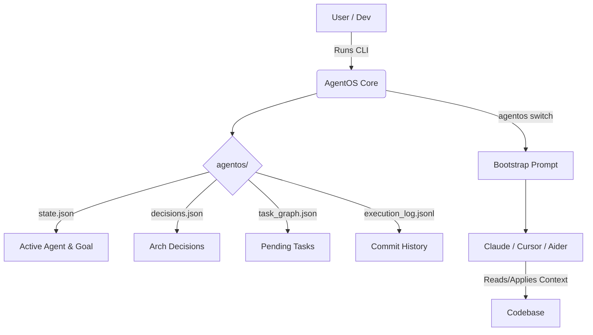

<div align="center">
  <h1>🤖 AgentOS</h1>
  <p><b>Cross-Agent Continuity Layer for AI Coding Assistants</b></p>

  [](https://badge.fury.io/js/agentos)
  [](https://opensource.org/licenses/MIT)

</div>

---

## 🚀 The Problem

When you work with AI coding assistants (like Cursor, Claude Engineer, Aider, OpenCode), they lack **shared context**. Switching from one agent to another means losing your current tasks, architectural decisions, recent changes, and state.

## 🌟 What is AgentOS?

**AgentOS** is a continuity layer designed to seamlessly bridge the gap between different AI assistants. It creates a robust, file-based memory layer (`agentos/`) directly in your project repository. 

Whenever you switch assistants, AgentOS generates a highly-condensed **bootstrap handoff prompt** containing:
- Pending Tasks
- Hard Architectural Decisions
- Recent History & Git changes
- Architecture Mapping

Your next AI agent can immediately pick up where the last one left off!

---

## ⚡ Features

- **🧠 Shared Memory State**: Maintain task lists, goals, and architectural decisions across sessions.
- **🔄 Seamless Handoffs**: Automatically generate a "bootstrap" prompt for your next AI agent via `agentos switch <agent>`.
- **📸 Intelligent Snapshots**: Take snapshots of your workspace before handing it over to another agent.
- **🛡️ Hard Decisions**: Enforce architectural guidelines that AI agents are strictly instructed *not* to override (`--hard`).
- **🔗 Git Integration**: Automatically logs AI agent activity into the execution log on every `git commit`.

---

## 🛠️ Installation

AgentOS is built with Node.js and TypeScript. You can install it globally via npm:

```bash
npm install -g agentos
```


---

## 📚 Quick Start

### 1. Initialize AgentOS in your project

Navigate to your existing project repository and run:

```bash
agentos init
```
*This creates the `.agentos/` directory and sets up the continuity layer, including a Git post-commit hook for tracking changes.*

### 2. Set your current Agent

```bash
agentos use claude
```
*(Options: claude, cursor, aider, opencode)*

### 3. Track Tasks and Decisions

```bash
# Add pending tasks
agentos task add "Build the login authentication flow"
agentos task add "Setup PostgreSQL database"

# Mark a task as done
agentos task done 1

# Enforce an architectural decision
agentos decision add "Use strictly React and functional components" --hard
```

### 4. Switch to a new Agent

If you want to move from your current IDE/agent to another (e.g., from Cursor to Claude), use:

```bash
agentos switch cursor
```
*This command auto-saves a snapshot, generates a Bootstrap Prompt, copies it to your clipboard, and sets the active agent.*

### 5. Check Status

```bash
agentos status
```
*Displays the current state, active agent, pending tasks, recent decisions, and file tree drift.*

---

## 📖 Command Reference

| Command | Description |
|---|---|
| `agentos init` | Initializes AgentOS in the current repo, setting up state files and git hooks. |
| `agentos status` | Displays the current agent status, tasks, and system state. |
| `agentos use <agent>` | Sets the active agent without generating a handoff prompt. |
| `agentos switch <agent>` | Snapshots state, generates a handoff prompt, copies it, and sets active agent. |
| `agentos task add/done/list` | Manage your agent's pending and completed tasks. |
| `agentos decision add/list` | Manage architectural decisions. Use `--hard` to make them strict for AI. |
| `agentos snapshot` | Manually captures a snapshot of the workspace and state. |
| `agentos rollback` | Reverts the workspace to a previous snapshot. |
| `agentos log-commit` | Logs git commits to the execution history (used mainly by the auto-hook). |
| `agentos repair` | Validates and fixes corrupted `.agentos/` JSON state files. |

---

## ⚙️ Architecture & Data Structure

AgentOS operates completely locally, saving data into a hidden `agentos/` directory in your root folder. This ensures memory travels with the repository.



The system uses:
- **`state.json`**: Current active agent, drift score, and session details.
- **`task_graph.json`**: A directed array of pending and completed tasks.
- **`decisions.json`**: A history of architectural guidelines (`overridable` or `hard`).
- **`execution_log.jsonl`**: A stream of commit histories mapping what the agents have built.

---

## 🤝 Contributing

We welcome contributions to expand AgentOS to more platforms, improve the prompt templates, and enhance state tracking!
1. Fork the repo.
2. Clone it locally and run `npm install`.
3. Create a feature branch: `git checkout -b feature/my-cool-idea`.
4. Commit your changes: `git commit -m "Add cool idea"`.
5. Push to the branch: `git push origin feature/my-cool-idea`.
6. Open a Pull Request!

---

## 📄 License

This project is licensed under the MIT License. See the [LICENSE](LICENSE) file for details.

---
<div align="center">
<i>Built to make AI Pair Programming seamless across any tool.</i>
</div>
